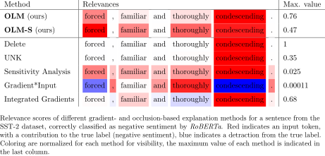

# OLM: Occlusion with Language Modeling




## Table of contents

* [Introduction](#introduction)
* [Overview](#-overview)
* [Requirements](#-requirements)
* [Installation](#-installation)
* [Experiments](#-experiments)
* [Citation](#-citation)
* [License](#-license)


## Introduction
Recently, state-of-the-art NLP models gained an increasing syntactic and semantic understanding of language and explanation methods are crucial to understand their decisions. 
**OLM** is a novel explanation method that combines **O**cclusion and **L**anguage **M**odels to sample valid and syntactically correct replacements with high likelihood, given the context of the original input.

This is the repository for the paper [Considering Likelihood in NLP Classification Explanations with Occlusion and Language Modeling](https://arxiv.org/abs/2004.09890). 


## 🔭&nbsp; Overview

| Path                     | Description                            |
|------------------------- |------------------------------  |
| [experiments/](experiments/) | This directory contains the scripts that run the experiments for the raw results in the paper. |
| [notebooks/](notebooks/) | This directory contains the notebooks that we used to calculate and visualize the results in the paper.|


## ✅&nbsp; Requirements

The code is tested with:

- Python 3.7


## 🚀&nbsp; Installation

### From source
```bash
git clone https://github.com/DFKI-NLP/olm
cd olm
pip install -r requirements.txt
```


## 🔬&nbsp; Experiments

### Datasets

The datasets are part of [GLUE](https://gluebenchmark.com/tasks) and can be downloaded by following the links below.
First, download the [datasets](datasets) and unpack into `data/glue_tasks/<TASK>/`.

| Dataset | Download |
| ------- | :--------: |
| SST-2| [[Link](https://firebasestorage.googleapis.com/v0/b/mtl-sentence-representations.appspot.com/o/data%2FSST-2.zip?alt=media&token=aabc5f6b-e466-44a2-b9b4-cf6337f84ac8)] |
| MNLI | [[Link](https://firebasestorage.googleapis.com/v0/b/mtl-sentence-representations.appspot.com/o/data%2FMNLI.zip?alt=media&token=50329ea1-e339-40e2-809c-10c40afff3ce)] |
| CoLA | [[Link](https://nyu-mll.github.io/CoLA/cola_public_1.1.zip)] |

### Fine-tune Model

#### SST-2

```bash
cd olm_tasks
./finetune_sst2.sh
```

#### CoLA

```bash
cd olm_tasks
./finetune_cola.sh
```

### Compute Relevances

```bash
PYTHONPATH="./" python experiments/<TASK>.py \
    --data_dir ./data/glue_data/<TASK>/ \
    --model_name_or_path <MODEL NAME OR PATH> \
    --output_dir <OUTPUT DIR> \
    --strategy grad \ # either one of grad, gradxinput, saliency, integratedgrad, unk, resampling, resampling_std, delete
    --do_run \
    --do_relevances \
    --cuda_device 0
```

### Visualize Results

`notebooks/relevance-mnli.ipynb` contains the notebook to visualize occlusion results.


## 📚&nbsp; Citation

If you find the code or dataset patch helpful, please cite the following paper:
```
@inproceedings{harbecke-alt-2020-olm,
    title={Considering Likelihood in NLP Classification Explanations with Occlusion and Language Modeling},
    author={David Harbecke and Christoph Alt},
    year={2020},
    booktitle={Proceedings of ACL 2020, Student Research Workshop},
    url={https://arxiv.org/abs/2004.09890}
}
```


## 📘&nbsp; License
OLM is released under the under terms of the [MIT License](LICENSE).
